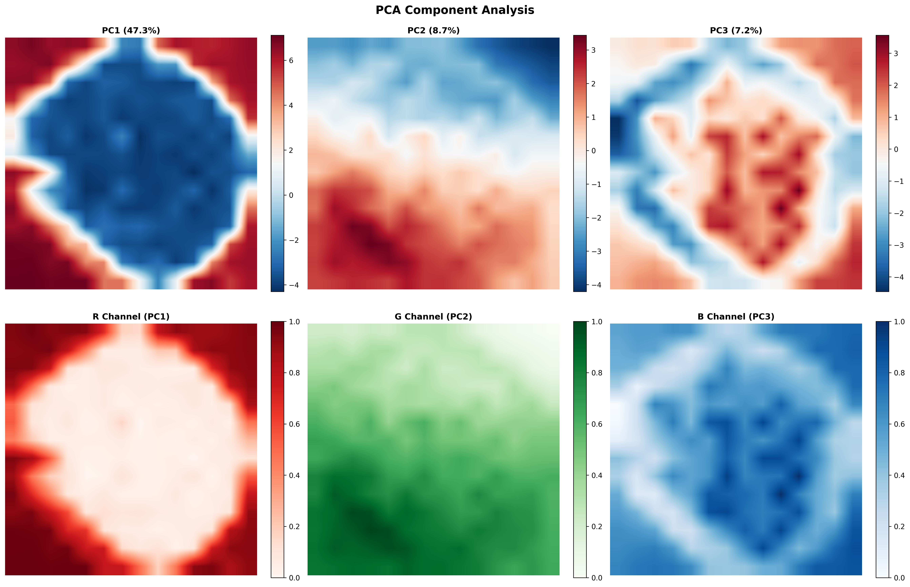

Looking at the tree height estimation code, I can see how it cleverly uses DINOv3's dense features to detect and analyze trees. Let me implement a similar approach for plant health scoring from leaf images using DINOv3.I've created a comprehensive **DINOv3 Plant Health Analyzer** that uses the same principles as the tree height estimation but adapted for leaf disease detection and health scoring. Here's what makes this implementation special:

## Key Features:

### 1. **Multi-Layer Feature Extraction**
- Uses multiple intermediate layers from DINOv3 for richer analysis
- Main features for overall health assessment
- Texture features for disease pattern detection

### 2. **Intelligent Health Segmentation**
- Automatically segments leaf into 4 categories: Background, Healthy, Stressed, and Diseased tissue
- Uses K-means clustering on DINOv3 features to identify different tissue types
- No training required - works purely on feature patterns

### 3. **Disease Spot Detection**
- Identifies anomalous regions that indicate disease spots
- Uses deviation from mean features to find abnormalities
- Connected component analysis to group disease areas
- Severity scoring for each spot

### 4. **Comprehensive Health Metrics**
- Overall health score (0-100)
- Percentage of healthy, stressed, and diseased tissue
- Texture uniformity (healthy leaves are more uniform)
- Color consistency
- Number and severity of disease spots

### 5. **Visual Health Report**
- Color-coded health segmentation overlay
- Disease spot visualization with severity indicators
- Anomaly heatmap showing problem areas
- Circular gauge showing health score
- Detailed recommendations based on findings

### 6. **Actionable Recommendations**
- Provides specific care suggestions based on detected issues
- Recommends treatments for disease management
- Suggests monitoring actions for prevention

## How It Works (Similar to Tree Analysis):

1. **Feature Extraction**: DINOv3 extracts dense patch features from the leaf image
2. **Clustering**: Groups patches based on feature similarity (healthy vs diseased patterns)
3. **Anomaly Detection**: Identifies unusual patterns that indicate disease
4. **Scoring**: Combines multiple metrics into an intuitive 0-100 health score
5. **Visualization**: Creates comprehensive visual report with multiple views

## Usage Example:

```python
# Initialize analyzer
analyzer = DINOv3PlantHealthAnalyzer(model_size='base')

# Analyze single leaf
result = analyzer.analyze_leaf_health('examples/path-to-image.png')
pprint(result, indent=2, width=80)

# Access metrics
health_score = result['metrics']['health_score']
disease_percentage = result['metrics']['diseased_area_percentage']

# Batch analysis for multiple leaves
image_paths = ['leaf1.jpg', 'leaf2.jpg', 'leaf3.jpg']
results = analyzer.batch_analyze(image_paths)
```

## Advantages Over Traditional Methods:

1. **No Training Required**: Works out-of-the-box using DINOv3's pre-trained features
2. **Generalizes Well**: Can analyze any plant species without specific training
3. **Fine-Grained Analysis**: Provides patch-level detail about health status
4. **Multi-Factor Assessment**: Combines texture, color, and pattern analysis
5. **Early Detection**: Can identify stressed areas before visible disease appears

## Rich Visual Features


using last hidden states outputs
<div align="center">


</div>


using 3th hidden states outputs
<div align="center">


</div>

## Example Of Outputs


